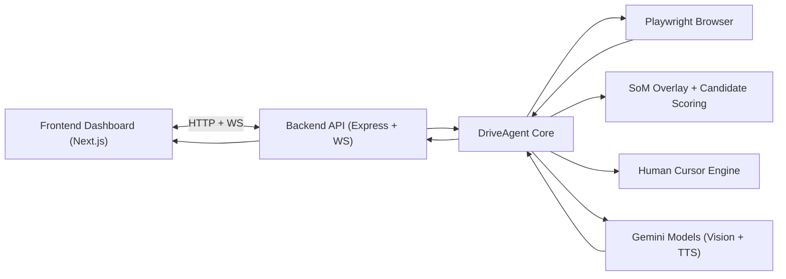

# AJETE

**A**utonomous **J**ob **E**xecution & **T**esting **E**ngine

AJETE is a prototype agent platform for realistic web journey simulation.  
It combines browser automation, visual grounding, persona behavior, and live observability in one control center.

The architecture is domain-agnostic and can be used across ecommerce, booking, customer portals, and enterprise web workflows.

## Why AJETE exists

Traditional UI tests answer: "Did this selector still exist?"  
AJETE answers: "Would a real user persona still complete this mission?"

It is designed to test user intent execution, not only DOM correctness:

- Can a user find a specific product flow?
- Does the agent get trapped in navigation loops?
- Are cookie banners blocking progress?
- Does behavior degrade across responsive breakpoints and zoom/device profiles?

## Core concepts implemented

### 1) Set of Marks (SoM)

Set of Marks is the central grounding mechanism for vision-to-action.

How it works:

- AJETE scans visible/interactable elements in the current viewport.
- It draws red bounding boxes and numeric IDs (`data-som-id`) over candidates.
- The screenshot sent to the LLM includes these marks.
- The LLM returns structured actions (`click`, `type`, `scroll`) against mark IDs.

Why this matters:

- Removes fragile dependency on natural language descriptions of screen regions.
- Gives deterministic, auditable references for each action.
- Makes step-by-step reasoning inspectable in logs and screenshots.

Additional SoM heuristics already implemented:

- Candidate de-duplication by overlap ratio.
- Interactive scoring based on semantic tags, ARIA roles, visibility, and behavior hints.
- Label placement strategy to reduce text/element occlusion.
- Configurable debug visibility for stream output while keeping SoM visible to the LLM.

### 2) Think-aloud control loop

The model is prompted to produce "thought + action" in strict JSON.

Loop phases:

1. Scan page + inject SoM
2. Capture screenshot
3. Ask model for next action
4. Emit thought/log/step
5. Execute action
6. Repeat

This creates a transparent "mind stream" that is useful for UX diagnosis and stakeholder review.

### 3) Human-like cursor simulation

Instead of teleport clicks, AJETE uses generated movement paths:

- Curved movement paths
- Variable speed and easing
- Optional overshoot behavior
- Visual click ripple feedback

This improves realism in demos and makes action traces easier to interpret.

### 4) Cookie handling with vision fallback

Cookie flows are handled in layers:

- Strict selector attempts
- Contextual button search in likely consent containers
- iFrame checks
- Coordinate-based fallback when visible banner text exists but DOM click fails

This is critical for real-world brand sites where consent managers vary heavily.

### 5) Persona simulation modes

Personas shape context and decision style:

- **Dieter**
- **Lukas**
- **Helmut**
- **Bare LLM** (no persona rules)
- **Monkey Mode** (random fuzz behavior)

Personas can also define a TTS profile (voice/style instructions) for spoken thought playback.

### 6) Blocking TTS playback

Optional Gemini TTS speaks model thoughts.
When enabled, the agent waits until playback is finished before executing the next step.

This enables realistic "live usability session" demonstrations with audible reasoning.

### 7) New-tab following

If an action opens a new tab/window, AJETE automatically follows it and continues execution there.
Fallback handling also switches to another open page if the active tab closes or crashes.

### 8) Headless mode

AJETE can run with visible browser UI or fully headless.
In headless mode, the frontend still receives screenshot/cursor/thought streams via WebSocket.

## High-level architecture



## Repository structure

```text
ajete/
  app/
    page.tsx
    legal/page.tsx
    stories/page.tsx
    globals.css
    layout.tsx
  public/
  backend/
    agent.ts
    server.ts
    config/personas.ts
    config/siteProfiles.ts
    utils/som.ts
    utils/cursor.ts
    utils/researchScorer.ts
    .env.example
  package.json
  next.config.ts
```

## Main runtime interfaces

### REST API (backend)

- `POST /start`
  - Starts a run with URL, persona, mission, model, debug mode, TTS, headless mode.
- `POST /stop`
  - Stops current run.
- `GET /models`
  - Returns available Gemini models supporting `generateContent`.

### WebSocket events

Backend -> Frontend:

- `status`
- `thought`
- `step`
- `screenshot`
- `cursor`
- `tts`
- `error`

Frontend -> Backend:

- `tts_done` (acknowledge playback completion)
- `tts_toggle` (enable/disable speech during a running session)

## Setup

### Prerequisites

- Node.js 20+ (recommended)
- npm
- Gemini API key

### 1) Backend

```bash
cd backend
cp .env.example .env
```

Set your key in `backend/.env`:

```env
GEMINI_API_KEY=your_gemini_api_key_here
```

Install and run:

```bash
npm install
npm run dev
```

Backend runs on `http://localhost:3001`.

### 2) Web App (Next.js)

In a second terminal, from repository root:

```bash
cd /path/to/ajete
npm install
npm run dev
```

Web app runs on `http://localhost:3000`.

## Environment and secrets

Secret handling policy:

- Real keys must only live in local `.env` files.
- `.env` is ignored by git.
- `.env.example` is safe template only.

Current required env vars:

- `backend/.env`
  - `GEMINI_API_KEY`

## Security notes

- Never commit production credentials.
- Do not log API keys in backend/frontend console output.
- Treat mission content as potentially sensitive test data.

## Observability

AJETE exposes rich run telemetry:

- Human-readable thought stream
- Structured step history
- Visual evidence (live screenshots)
- Cursor path visualization
- Explicit state transitions (`starting`, `scanning`, `thinking`, `acting`, `stopped`)

This makes failed flows diagnosable without reproducing blind.

## Current limitations

- SoM works per viewport snapshot, not full semantic page graph memory.
- LLM actions can still loop in highly ambiguous UIs (mitigated by anti-loop heuristics).
- Browser audio policies can block TTS until user interaction unlocks audio context.
- TTS accent/style control is best-effort and model-dependent.

## Suggested prototype use cases

- Product/accessory discovery journey validation
- "Can a first-time user complete mission X?" checks
- Comparative runs across personas and model versions
- Headless regression smoke runs before releases
- UX diagnostics for menu/findability bottlenecks

## Troubleshooting

### `WebSocket connection failed`

- Ensure backend is running on port `3001`.
- Ensure frontend is using `ws://localhost:3001`.

### `TTS playback blocked by browser`

- Click once inside the app window to unlock audio.
- Keep `Voice TTS` enabled and retry.

### `SoM overlay skipped ... exports is not defined`

- Ensure latest backend code is running (SoM evaluate wrapper fix is included in this repo).

### `429 Too Many Requests` from Gemini

- Reduce run frequency.
- Add retries/backoff (already implemented for core vision calls).
- Consider model fallback or quota upgrade.

## Roadmap ideas

- Run replay timeline with side-by-side diff
- KPI scoring (time-to-goal, loop rate, recovery rate)
- Scenario suites for CI
- Accessibility mission packs
- Multi-locale persona packs

## License

No license file is included yet. Add one before public/open-source distribution.
